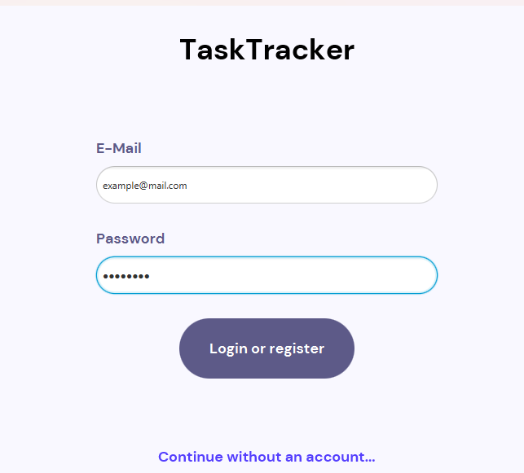
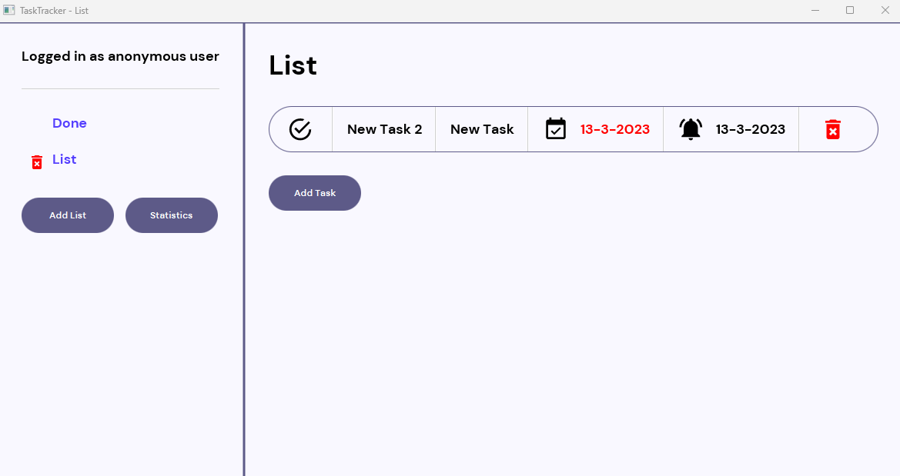
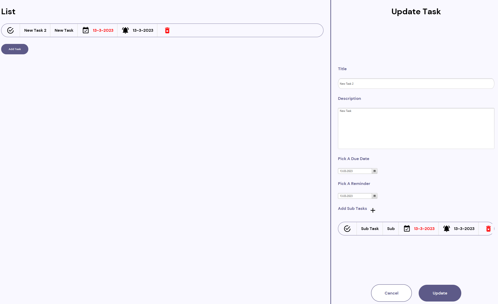

# Programmentwurf_ASE

Project for Advanced Software Engineering at DHBW Karlsruhe.

## Run and debug

Run: Navigate into `tasktracker-modules/tasktracker-parent`. Run the command `mvn clean install` from within the folder with the parent pom. Afterwards navigate further into `tasktracker-plugins` and execute `mvn javafx:run` to run the application.

Debug: Navigate into folder `tasktracker-modules/tasktracker-parent/tasktracker-plugins`. Run the command `mvn clean javafx:run@debug`. Attach the Java debugger by running the attach configuration in the launch.json.

Run tests: Navigate into folder where the pom.xml is located. Run the command `mvn test`. Note that the database tests will fail if no database is currently running. You can use the command provided in ./docker/mysql.bat to start a docker container running a MySQL database.

Debug tests: Run the command `mvnDebug test -DforkMode=never`.

## Use Cases

### Login to the application

You can enter an e-mail address and password to login to the application. An active database connection needs to be present for this to work. If the e-mail is not registered yet the application will create a new account. Otherwise it will try to login the user asociated with the given e-mail address.

If there is no database locally you can use the option to login without an account. All data will be stored on the file system in that case.

### The main view

After logging in one way or the other you will see the main view of the application. On the left all existing lists are shown and new ones can be added. The list with the name "Done" will store all tasks that were marked as such. By clicking the name of a list its tasks will be displayed in the center. Clicking the checkmark will mark them as completed. You can also delete tasks by clicking the bin on the right.

### Updating a task

Clicking on a task will also open the update task window where the existing info of a task can be changed and sub tasks can be added.

