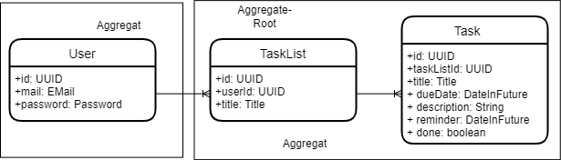

# Schriftliche Ausarbeitung

## Domain Driven Design (DDD)

### Analyse der Ubiquitous Language

<!-- 
- Was ist die Ubiquitous Language? 
- Was sind wichtige Begriffe/Prozesse in meiner Problemdomäne? 
- Was für Regeln gelten bei den jeweiligen Prozessen?
-->

Die Ubiquitous Language ist ein Konzept des Domain Driven Design, welches Verständnisprobleme zwischen Entwicklern und Domänenexperten, durch das Definieren einer gemeinsamen Projektsprache, vorbeugen soll. Die Projektsprache beinhaltet Definitionen für das gemeinsame Verständnis von Konzepten, Prozessen und Regeln aus der Domäne.

Wichtige Begriffe und Prozesse innerhalb der Problemdomäne "Aufgabenliste" sind:

- Aufgabe (Task)
- Fälligkeitsdatum (Due Date)
- Aufgabenliste (Task List)
- Arbeitsschritt (Sub Task)
- Erinnerung (Reminder)
- Liste anlegen
- Aufgabe verschieben/löschen/bearbeiten
- Liste löschen/bearbeiten

Aufgabe (Task):

Eine Aufgabe besteht aus Name/Titel, Erinnerungsdatum, Arbeitsschritte, Beschreibung/Notiz, Fälligkeitsdatum. Zudem hat eine Aufgabe mehrere mögliche Zustände:

- Erledigt und nicht erledigt
- Fälligkeitsdatum überschritten/nicht überschritten

Alle Bestandteile, außer dem Namen, sind optional. Die Anzahl Arbeitsschritte ist logisch nicht begrenzt.

Fälligkeitsdatum (Due Date):

Ein Fälligkeitsdatum kann auf einer Aufgabe gesetzt werden. Es ist darauf zu achten, dass das Fälligkeitsdatum nicht in der Vergangenheit liegen darf. Ist das Fälligkeitsdatum auf einer Aufgabe erreicht muss dies in der Aufgabe gekennzeichnet werden.

Aufgabenliste (Task List):

Eine Aufgabenliste kann mehrere (theoretisch unbegrenzt viele) Aufgaben beinhalten. Sie kann aber auch keine Aufgabe beinhalten. Aufgabenlisten können vom Benutzer erstellt werden. Dabei wird ein Name vom Benutzer festgelegt, welcher über alle Listen eindeutig sein muss. Die Bestandteile einer Aufgabenliste sind folglich ihr Name und eine Reihe von Aufgaben.

Arbeitsschritt (Sub Task):

Ein Arbeitsschritt kann selbst wieder als Aufgabe verstanden werden, mit dem Unterschied, dass ein Arbeitsschritt keine weiteren Arbeitsschritte enthalten darf.

Erinnerung (Reminder):

Eine Erinnerung kann auf einer Aufgabe gesetzt werden. Es ist erneut darauf zu achten, dass das Erinnerungsdatum nicht in der Vergangenheit liegt. Ist das Erinnerungsdatum auf einer Aufgabe erreicht, muss der Benutzer darüber in Kenntnis gesetzt werden.

Liste anlegen:

Eine neue Liste anzulegen heißt ihr einen eindeutigen Namen zu geben. Nach dem Anlegen der Liste ist diese zunächst leer. Der Benutzer hat jetzt die Möglichkeit zu dieser Liste Aufgaben hinzuzufügen.

Aufgabe verschieben/löschen/bearbeiten:

Eine Aufgabe zu verschieben heißt, sie von einer Liste in eine andere zu bewegen. Dafür muss die entsprechende Aufgabe aus der Aufgabenliste, in der sie sich momentan befindet, gelöscht und anschließend einer anderen Liste hinzugefügt zu werden.  
Eine Aufgabe zu löschen heißt alle mit ihr assoziierten Daten aus der Applikation zu entfernen, sodass diese anschließend nicht mehr abrufbar sind.  
Eine Aufgabe zu bearbeiten, heißt eines der oben genannten Bestandteile einer Liste zu verändern oder die Aufgabe als erledigt bzw. unerledigt zu markieren. Wird eine Aufgabe als erledigt markiert wird sie aus ihrer aktuellen Liste entfernt und einer nicht vom Benutzer verwalteten Liste von erledigten Aufgaben zugeteilt, damit diese später noch abgerufen werden können. Eine Aufgabe als erledigt zu markieren ist also nicht dasselbe wie sie zu löschen! Wird eine Aufgabe wieder als unerledigt markiert wird ihr Status entsprechend verändert und sie wird der ursprünglichen Liste hinzugefügt aus der sie gekommen ist.

Liste löschen/bearbeiten:

Wird eine Liste gelöscht, dann löschen sich auch alle in ihr enthaltenen Aufgaben. Eine Liste zu bearbeiten bedeutet ihren Namen zu verändern. Dabei muss erneut geprüft werden, dass der Name eindeutig ist.

### Analyse und Begründung der verwendeten Muster

#### Value Objects

<!--
- Was sind Value Objects (VOs)?
- Wo habe ich VOs in meinem Projekt verwendet und warum?
- Bspw. DueDate(Date)?, EMail(String)
-->

Value Objects (VOs) kapseln einen oder mehrere Werte in einem neuen Wert/Typ. Das Value Object kann daraufhin die Einhaltung von bestimmten Regeln, die in der Problemdomäne gegenüber dem gekapselten Wert bestehen, prüfen. Ein VO muss unveränderlich sein. Das hat den Vorteil, dass der Zustand nach der Erzeugung eines VOs nicht mehr ungültig gemacht werden kann. Zwei VOs sind gleich, wenn ihre gekapselten Werte übereinstimmen.

Die Klasse _dev.fg.dhbw.ase.tasktracker.domain.vo.DateInFuture_ ist ein solches Value Object. Es dient der Kapselung eines normalen Werts vom Typ _java.util.Date_ um zu kontrollieren, dass dieses nicht in der Vergangenheit liegt. Nach der Instanziierung lässt sich der gekapselte Wert nicht mehr ändern (immutability). Die beiden Methoden _hashCode()_ und _equals()_ wurden überschrieben, um die Gleichheit zweier Objekte vom Typ _DueDate_ bei Gleicheit des gekapselten Datums zu gewährleisten.

<!-- Weitere Value Objects im Projekt? -->
Weitere Value Objects sind:

- dev.fg.dhbw.ase.tasktracker.domain.vo.Title (der Titel darf nicht _null_ oder leer sein)
- dev.fg.dhbw.ase.tasktracker.domain.vo.EMail (kapselt einen String um zu überprüfen, ob dieser dem Format einer E-Mail entspricht)
- dev.fg.dhbw.ase.tasktracker.domain.vo.Password (prüft die Anforderungen an das Passwort in der Anwendung)

#### Entities

<!--
- Was sind Entities?
- Wo habe ich Entities in meinem Projekt verwendet und warum?
- Bspw. Task oder TaskList, User?
-->

Entitäten zeichnen sich durch eine eindeutige Identität und einen eigenen Lebenszyklus aus. Entitäten aggregieren Werte (auch VOs) zu einem Ganzen und repräsentieren die, für die Domäne relevanten, Daten/"Dinge", mit denen die Applikation arbeitet. Entitäten werden in der Persistenzschicht persistiert.

Entitäten im vorliegenden Projekt sind:

- dev.fg.dhbw.ase.tasktracker.domain.entities.Task
- dev.fg.dhbw.ase.tasktracker.domain.entities.TaskList
- dev.fg.dhbw.ase.tasktracker.domain.entities.User

Beispielsweise ist die Klasse _dev.fg.dhbw.ase.tasktracker.domain.entities.Task_ eine Entität, da sie das Kernstück der Daten darstellt mit dem ein Aufgabenplaner/eine Aufgabenliste offensichtlicher Weise arbeitet. Außerdem ist sie eindeutig durch eine ID identifizierbar und muss, um für den Anwender und die Anwendung von Nutzen zu sein, persistiert werden. Sie aggregiert dafür mehrere Daten darunter auch die VOs _dev.fg.dhbw.ase.tasktracker.domain.vo.Title_ und _dev.fg.dhbw.ase.tasktracker.domain.vo.DateInFuture_. Die Daten, die von der Entität aggregiert werden, können des Weiteren vom Anwender geändert werden d.h., es existiert ein eigener Lebenszyklus.

#### Domain Services

<!--
- Was ist ein Domain Service?
- Wo und warum habe ich einen Domain Service bei mir eingesetzt?
-->

#### Aggregates

<!--
- Was ist die "Root Entity" in meinem Aggregat und warum?
- Keine direkten Abhängigkeiten! Nur Abhängigkeit über IDs!!!
- Bspw. über die TaskList komme ich zu einem bestimmten Task
- Mögliches Aggregat: TaskListAggregate(TaskList, Task)?
-->

Aggregate sind Zusammenfassungen von Entitäten oder VOs, die miteinander in Beziehung stehen (1:n, n:m oder 1:1 usw.). Dabei hat jedes Aggregat eine sog. _Aggregate Root_, über die auf Elemente des Aggregats zugegriffen werden kann. Aggregate dienen dazu Objektbeziehungen zu entkoppeln und Domänenregeln einzuhalten, indem die _Aggregate Root_ den direkten Zugriff auf, in der Beziehungshierarchie weiter unten liegende Objekte, verhindert und die Änderung von Daten kontrollieren kann.

Als Aggregate wurden gewählt das _User-Aggregat_ (enthält nur die Entität _User_) und das _Task-List-Aggregat_ (enthält die Entitäten _TaskList_ und _Task_).

#### Repositories

<!--
- Beschreibung und Realisierung in unterschiedlichen Packages! Keine Vermischung von essential und accidental complexity!
- Nur je Aggregate Root! -> TaskListRepository, TaskListLocalRepository?, TaskListDBRepository?
-->

Ein Repository ist die Schnittstelle zwischen der Domäne und der Persistenzschicht. Für jedes _Aggregate Root_ (s.o.) wird ein Repository benötigt. In diesem Fall sind dies das _dev.fg.dhbw.ase.tasktracker.persistence.TaskListRepository_ und das _dev.fg.dhbw.ase.tasktracker.persistence.UserRepository_. Ein Repository ist zunächst nur eine Schnittstelle (interface) die aber eine Vielzahl von Ausprägungen haben kann. Wichtig ist, dass diese konkreten Ausprägungen nicht mit der Domäne vermischt werden, da diese sich nicht für die konkrete Implementierung der Persistenz interessiert. Der Domäne wird nur das Interface präsentiert. Dies hat den Vorteil, dass im Hintergrund beliebige Implementierungen genutzt und diese auch reibungslos ausgetauscht werden können. Folgende Implementierungen sind in dieser Applikation vorhanden:

- _TaskListDatabaseRepository_: Verwendet eine Datenbankverbindung (_MySQL_) und den _Object Relational Mapper_ Hibernate um Aufgabenlisten und Aufgaben zu persistieren (Laden, Ändern, Löschen).
- _TaskListFileSystemRepository_: Stellt eine Möglichkeit bereit Aufgaben und Aufgabenlisten in dem Dateisystem des Nutzers zu persistieren, falls dieser kein Benutzerkonto anlegen möchte.
- _UserDatabaseRepository_: Wie _TaskListDatabaseRepository_ aber zur Verwaltung von Nutzern in der Datenbank.

Um die _accidental complexity_ (Peristierung) von der _essential complexity_ zu trennen wird nur das Repository-Interface nach außen gegeben und alle Klassen die mit der Persistenzschicht zu tun haben sind in einem separaten Package abgelegt.

#### Factories

Factories dienen der Erzeugung von Objekten unter Einhaltung domänenspezifischer Reglementierungen. Sie sind v.a. dann nützlich, wenn diese Reglementierungen und damit die Erzeugung des Objekts sehr komplex sind. Dabei kann eine Factory eine dedizierte Klasse zur Erzeugung anderer Objekte oder eine simple Methode sein. Ein Beispiel für eine Factory ist die Klasse _dev.fg.dhbw.ase.tasktracker.domain.factories.TaskFactory_. Diese stellt einige statische Methoden zur vereinfachten Erzeugung von Objekten des Typs _Task_ bereit. Der Standardkonstruktor wird versteckt damit keine Objekte vom Typ _TaskFactory_ erzeugt werden können.

## Clean Architecture

### Schichtarchitektur planen und begründen

## Programming Principles

### Analyse und Begründung für SOLID

#### Single Responsibility Principle (SRP)

#### Open/Closed Principle (OCP)

#### Liskov Substitution Principle (LSP)

#### Interface Segregation Principle (ISP)

#### Dependency Inversion Principle (DIP)

### Analyse und Begründung für GRASP

<!--
- GRASP = General Responsibility Assignment Software Patterns
- Was ist GRASP?
- Low Coupling
- High Cohesion
- Information Expert
- Polymorphism
- Pure Fabrication
- Indirection/Delegation
- Protected Variations
- Controller
- Creator
- Jedes Prinzip/Muster erklären und ein Beispiel im Projekt angeben
- Warum wurde das Prinzip an der jeweiligen Stelle eingesetzt?
- "Das Prinizip xyz besagt, ... Dies wird z.B. in der Klasse xyz berücksichtigt, weil..."
-->

#### Low Coupling

#### High Cohesion

#### Information Expert

#### Polymorphism

#### Pure Fabrication

#### Indirection/Delegation

#### Protected Variations

#### Controller

#### Creator

### Analyse und Begründung für DRY

<!--
- DRY = Don't Repeat Yourself
- Was bedeutet das?
- An welchen Stellen habe ich DRY angewendet und warum?
-->

## Refactoring

### Code Smells identifizieren

### Begründung durchgeführter Refactorings

<!--
- Welche Art von Refactoring habe ich durchgeführt?
- Wo habe ich das Refactoring durchgeführt? (Stellen im Code und Commits angeben)
- Warum habe ich das Refactoring durchgeführt?
- Evtl. Screenshots vom Code?
-->

## Entwurfsmuster

### Observer

### Einsatz begründen
